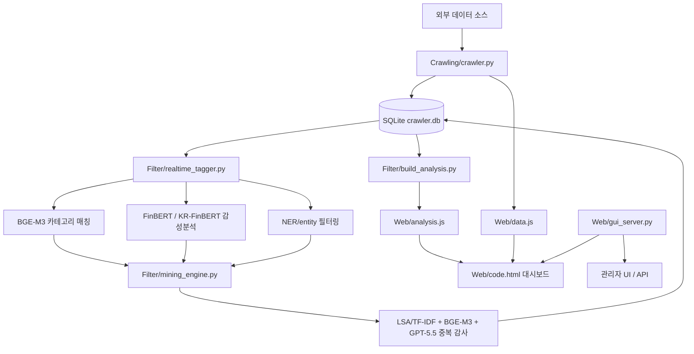

# PolitiMarket

PolitiMarket은 정치, 지정학, 정부 발표, 뉴스, 싱크탱크, 소셜 미디어, 시장 지표 데이터를 수집한 뒤 자연어 처리(NLP)로 금융시장 영향 가능성을 분석하는 Flask 기반 로컬 웹 대시보드 프로젝트입니다.

현재 파이프라인은 공식 API 기반 수집, GPU 기반 NLP 태깅, 감성분석, 중복 탐지, GPT-5.5 검증, 시장지표 시각화를 하나의 대시보드로 묶어 제공합니다.

## 주요 기능

- X 공식 API, Truth Social, 한국 정부/뉴스, 싱크탱크, Axios, Kremlin, People.cn, 시장지표 수집
- X API v2 기반 계정/검색어/최근 조회/전체 백필 설정
- 기본 6분 쿨타임과 20% jitter가 적용된 실시간 크롤링 루프
- 사용자가 지정한 기간만큼 전체 수집원을 다시 가져오는 X일 백필 기능
- BGE-M3 기반 시장 섹터 카테고리 분류
- FinBERT, KR-FinBERT 기반 감성분석
- NER/entity dictionary 기반 시장 관련성 필터링
- 애매한 카테고리/엔티티/중복 후보에 대한 GPT-5.5 검증
- LSA/TF-IDF SVD-128, BGE-M3, 제목/URL/출처/시간 feature, GPT 감사를 결합한 중복 탐지
- 크롤러 제어, 모델 설정, 태깅 감사, 중복 감사, 로그, 테스트 데이터셋을 관리하는 Flask 관리자 UI
- KOSPI/KOSDAQ은 Naver Finance, 글로벌 지수는 Yahoo Finance를 사용하는 Market Indices 대시보드

## 프로젝트 구조

```text
PolitiMarket/
|-- Crawling/
|   |-- crawler.py              # 메인 크롤러 및 백필 진입점
|   |-- run_crawler_loop.py     # 실시간 스케줄러 루프
|   `-- db_utils.py             # SQLite 스키마 및 저장 헬퍼
|-- Filter/
|   |-- realtime_tagger.py      # BGE/FinBERT/NER 실시간 태깅 파이프라인
|   |-- mining_engine.py        # GPT 검증, NER, 중복 탐지 파이프라인
|   |-- build_analysis.py       # 대시보드 분석 artifact 생성
|   |-- train_scheduler.py      # 키워드 튜닝 artifact 생성
|   `-- report_current_comparison.py
|-- Web/
|   |-- gui_server.py           # Flask API 및 관리자 서버
|   |-- code.html               # 메인 분석 대시보드
|   `-- templates/gui.html      # 관리자 UI
|-- Test_dataset/               # 합성 테스트 데이터셋
|-- requirements.txt
|-- requirements-nlp.txt
`-- WINDOWS_SETUP.md
```

`Crawling/crawler.db`, `Web/data.js`, `Web/analysis.js`, `Filter/output/`, 로그, 로컬 인증 정보, export 결과물은 실행 중 생성되는 파일이므로 Git에 포함하지 않습니다.

## 파이프라인 개요



## 요구 사항

- Python 3.12 권장
- Windows 환경 기준으로 작성되었지만 Python 실행 환경이면 다른 OS에서도 일부 사용 가능
- 전체 NLP 런타임 사용 시 CUDA 지원 GPU 권장
- X 수집을 위한 X API Bearer Token
- GPT-5.5 검증 및 요약 기능을 위한 OpenAI API Key

기본 의존성 설치:

```powershell
python -m pip install -r requirements.txt
```

전체 NLP/GPU 의존성 설치:

```powershell
python -m pip install -r requirements-nlp.txt
```

`requirements-nlp.txt`는 PyTorch CUDA wheel용 extra index를 사용합니다. CUDA 버전이 다르면 PyTorch 설치 패키지를 환경에 맞게 조정해야 합니다.

## 로컬 설정

API 키와 토큰은 절대 Git에 커밋하지 않습니다.

애플리케이션은 다음 환경변수 또는 Git에서 제외된 로컬 JSON 파일을 사용합니다.

- `X_BEARER_TOKEN`
- `OPENAI_API_KEY`
- `Crawling/crawler_config.json`
- `Crawling/llm_config.json`
- `Crawling/truth_tokens.json`

위 파일들은 `.gitignore`에 포함되어 있습니다.

## 실행 방법

프로젝트 루트에서 실행합니다.

```powershell
.\.venv\Scripts\python.exe Web\gui_server.py
```

브라우저에서 다음 주소를 엽니다.

```text
http://127.0.0.1:8080/
```

관리자 화면:

```text
http://127.0.0.1:8080/
```

메인 분석 대시보드:

```text
http://127.0.0.1:8080/code.html
```

## 자주 쓰는 명령어

1회 전체 수집, 태깅, 분석 실행:

```powershell
.\.venv\Scripts\python.exe Crawling\crawler.py --once
```

최근 2일 기준 전체 수집원 백필:

```powershell
.\.venv\Scripts\python.exe Crawling\crawler.py --backfill-days 2
```

실시간 크롤러 루프 실행:

```powershell
.\.venv\Scripts\python.exe Crawling\run_crawler_loop.py
```

대시보드 분석 파일 재생성:

```powershell
.\.venv\Scripts\python.exe Filter\build_analysis.py
```

태깅 작업 초기화 및 재실행:

```powershell
.\.venv\Scripts\python.exe Filter\run_tagging_rework.py
```

## 현재 모델 구성

| 영역 | 기본값 |
| --- | --- |
| 카테고리 임베딩 | `BAAI/bge-m3` |
| 영문 감성분석 | `ProsusAI/finbert` |
| 국문 감성분석 | `snunlp/KR-FinBert-SC` |
| 운영 태깅 모델 버전 | `bge-finbert-ner-keyword-v1` |
| 중복 탐지 파이프라인 | `lsa-tfidf-svd-128+bge-m3+gpt55` |
| GPT 모델 | `gpt-5.5` |
| GPT reasoning effort | `medium` |
| 실시간 크롤링 기본 간격 | `360s` |
| 크롤링 jitter | `20%` |

## 데이터 정책

이 저장소에는 소스 코드와 합성 테스트 데이터만 저장합니다.

운영 중 쌓이는 실제 크롤링 데이터는 공개 저장소에 포함하지 않습니다. 크롤링 데이터에는 뉴스 기사 본문, 소셜 미디어 글, 모델 출력, 로컬 상태, 개인 토큰이 섞일 수 있습니다. 공개 데이터셋이 필요하면 기사 본문과 비밀값을 제거한 정제 샘플을 별도로 export한 뒤 커밋해야 합니다.

## 보안 확인 사항

푸시 전 다음 파일들이 추적되지 않는지 확인합니다.

```text
Crawling/crawler_config.json
Crawling/llm_config.json
Crawling/truth_tokens.json
Crawling/crawler.db
Web/data.js
Web/analysis.js
Filter/output/
Exports/
```

확인은 다음 명령어로 할 수 있습니다.

```powershell
git status --ignored
```
