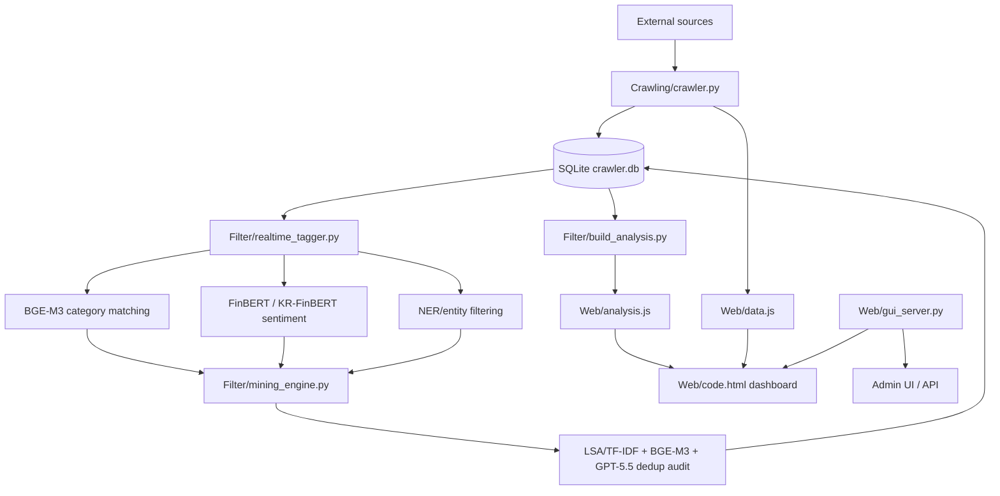

# PolitiMarket

PolitiMarket is a local Flask-based NLP dashboard that collects political, geopolitical, government, news, think-tank, social, and market-index signals, then estimates their potential impact on financial-market sectors.

The current pipeline combines official-source crawling, GPU-backed NLP tagging, market sentiment scoring, duplicate detection, and a web dashboard for monitoring collection quality and analysis results.

## Key Features

- Multi-source crawler for X official API, Truth Social, Korean government/news, think tanks, Axios, Kremlin, People.cn, and market indices
- X API v2 based collection with configurable accounts, search queries, recent lookback, and full backfill mode
- Realtime crawl loop with a 6-minute base cooldown and 20% jitter
- All-source backfill by user-defined day window
- BGE-M3 category matching for market-sector classification
- FinBERT and KR-FinBERT sentiment inference
- NER/entity dictionary based market relevance filtering
- GPT-5.5 review for ambiguous category/entity decisions and duplicate-candidate auditing
- Duplicate detection using LSA/TF-IDF SVD-128, BGE-M3 similarity, title/URL/source/time features, and GPT audit
- Flask admin UI for crawler controls, model configuration, tagging audit, dedup audit, logs, and test datasets
- Market Indices dashboard using Naver Finance for KOSPI/KOSDAQ and Yahoo Finance for global indices

## Project Structure

```text
PolitiMarket/
├─ Crawling/
│  ├─ crawler.py              # Main crawler and backfill entry point
│  ├─ run_crawler_loop.py     # Realtime scheduler loop
│  └─ db_utils.py             # SQLite schema and persistence helpers
├─ Filter/
│  ├─ realtime_tagger.py      # BGE/FinBERT/NER realtime tagging pipeline
│  ├─ mining_engine.py        # GPT review, NER helpers, dedup pipeline
│  ├─ build_analysis.py       # Builds dashboard analysis artifacts
│  ├─ train_scheduler.py      # Exports keyword-tuning artifacts
│  └─ report_current_comparison.py
├─ Web/
│  ├─ gui_server.py           # Flask API and admin server
│  ├─ code.html               # Main dashboard
│  └─ templates/gui.html      # Admin UI
├─ Test_dataset/              # Synthetic test datasets
├─ requirements.txt
├─ requirements-nlp.txt
└─ WINDOWS_SETUP.md
```

Generated runtime files such as `Crawling/crawler.db`, `Web/data.js`, `Web/analysis.js`, `Filter/output/`, logs, local credentials, and exports are intentionally excluded from Git.

## Pipeline Overview



## Requirements

- Windows or another Python-capable local environment
- Python 3.12 recommended
- CUDA-capable GPU recommended for the full NLP runtime
- X API Bearer Token for X collection
- OpenAI API key for GPT-5.5 review and summary features

Base dependencies:

```powershell
python -m pip install -r requirements.txt
```

Full NLP/GPU dependencies:

```powershell
python -m pip install -r requirements-nlp.txt
```

`requirements-nlp.txt` currently targets the CUDA PyTorch wheel through the PyTorch extra index. Adjust the PyTorch package if your CUDA version differs.

## Local Configuration

Do not commit local API keys or tokens.

The application reads secrets from environment variables or ignored local JSON files:

- `X_BEARER_TOKEN`
- `OPENAI_API_KEY`
- `Crawling/crawler_config.json`
- `Crawling/llm_config.json`
- `Crawling/truth_tokens.json`

These files are ignored by `.gitignore`.

## Running the App

From the project root:

```powershell
.\.venv\Scripts\python.exe Web\gui_server.py
```

Then open:

```text
http://127.0.0.1:8080/
```

Admin page:

```text
http://127.0.0.1:8080/
```

Main dashboard:

```text
http://127.0.0.1:8080/code.html
```

## Common Commands

Run one full crawl/tag/analyze cycle:

```powershell
.\.venv\Scripts\python.exe Crawling\crawler.py --once
```

Run all-source backfill for the last 2 days:

```powershell
.\.venv\Scripts\python.exe Crawling\crawler.py --backfill-days 2
```

Run the realtime crawler loop:

```powershell
.\.venv\Scripts\python.exe Crawling\run_crawler_loop.py
```

Rebuild dashboard analysis artifacts:

```powershell
.\.venv\Scripts\python.exe Filter\build_analysis.py
```

Reset and rerun tagging work:

```powershell
.\.venv\Scripts\python.exe Filter\run_tagging_rework.py
```

## Current Model Configuration

| Area | Default |
| --- | --- |
| Category embedding | `BAAI/bge-m3` |
| English sentiment | `ProsusAI/finbert` |
| Korean sentiment | `snunlp/KR-FinBert-SC` |
| Runtime model version | `bge-finbert-ner-keyword-v1` |
| Dedup pipeline | `lsa-tfidf-svd-128+bge-m3+gpt55` |
| GPT model | `gpt-5.5` |
| GPT reasoning effort | `medium` |
| Realtime crawl interval | `360s` |
| Crawl jitter | `20%` |

## Data Policy

This repository is intended to store source code and synthetic test data only.

Operational data is excluded because crawled content can contain copyrighted article bodies, social-media text, generated model outputs, local state, and private tokens. If a public dataset is needed, export a sanitized sample that removes raw article bodies and secrets before committing it.

## Security Notes

Before pushing changes, verify that these files remain untracked:

```text
Crawling/crawler_config.json
Crawling/llm_config.json
Crawling/truth_tokens.json
Crawling/crawler.db
Web/data.js
Web/analysis.js
Filter/output/
Exports/
```

Use `git status --ignored` to confirm local runtime files are ignored.
