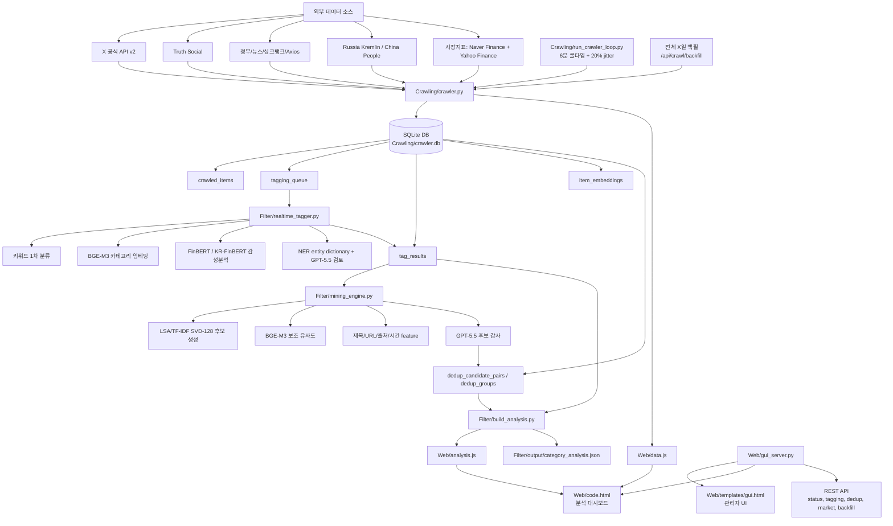

# 자연어 처리(NLP) 웹 프로젝트 핵심 소스 코드 가이드

본 문서는 현재 개발 중인 **정치/지정학 뉴스 기반 금융시장 영향 분석 웹 프로젝트**의 최신 소스 코드 구조와 핵심 동작 원리를 정리한 문서이다.

기준 경로: `C:\Users\sejun\Desktop\Project\NLP ver.2`  
최신 반영 기준: 2026-06-10  
현재 핵심 모델 구성: `BGE-M3 + FinBERT/KR-FinBERT + NER dictionary + LSA/TF-IDF SVD-128 + GPT-5.5`

---

## 1. 프로젝트 아키텍처 및 데이터 흐름

프로젝트는 크게 **수집(Crawling)**, **저장(SQLite)**, **실시간 NLP 태깅**, **중복 탐지**, **분석 결과 생성**, **Flask 대시보드/API**로 구성된다.



---

## 2. 디렉터리 및 핵심 파일 요약

| 구분 | 파일 경로 | 현재 역할 |
| :--- | :--- | :--- |
| **Web UI / API** | [Web/gui_server.py](file:///C:/Users/sejun/Desktop/Project/NLP%20ver.2/Web/gui_server.py) | Flask 서버. 스케줄러 시작/정지, X API 설정, GPT-5.5 설정, 전체 백필, 태깅 감사, 중복 감사, 시장지표 API를 제공한다. |
| | [Web/templates/gui.html](file:///C:/Users/sejun/Desktop/Project/NLP%20ver.2/Web/templates/gui.html) | 관리자 화면. 수집원 On/Off, X API 설정, GPT 설정, 백필 실행, 태깅/중복 감사 결과를 표시한다. |
| | [Web/code.html](file:///C:/Users/sejun/Desktop/Project/NLP%20ver.2/Web/code.html) | 사용자 대시보드. 카테고리별 시장 영향, 최신 기사, Market Indices 그래프, 태깅 진행률을 표시한다. |
| **Crawling** | [Crawling/crawler.py](file:///C:/Users/sejun/Desktop/Project/NLP%20ver.2/Crawling/crawler.py) | X 공식 API, Truth Social, 정부/뉴스/싱크탱크/Axios/Russia/China 수집과 백필 실행의 중심 파일이다. |
| | [Crawling/run_crawler_loop.py](file:///C:/Users/sejun/Desktop/Project/NLP%20ver.2/Crawling/run_crawler_loop.py) | 실시간 루프 실행기. 기본 6분 간격에서 20% jitter를 적용해 4.8~6분 사이 임의 시점에 수집한다. |
| | [Crawling/db_utils.py](file:///C:/Users/sejun/Desktop/Project/NLP%20ver.2/Crawling/db_utils.py) | SQLite 스키마 생성, 수집 데이터 저장, 태깅 큐, 결과 테이블, 중복 그룹 테이블을 관리한다. |
| **NLP Engine** | [Filter/realtime_tagger.py](file:///C:/Users/sejun/Desktop/Project/NLP%20ver.2/Filter/realtime_tagger.py) | 실시간 태깅 엔진. BGE-M3 카테고리 분류, FinBERT/KR-FinBERT 감성분석, Excluded 처리, GPU 요구 조건, 모델 로드 오류 보고를 담당한다. |
| | [Filter/mining_engine.py](file:///C:/Users/sejun/Desktop/Project/NLP%20ver.2/Filter/mining_engine.py) | NER/entity filtering, GPT-5.5 Responses API 호출, LSA/BGE/GPT 기반 중복 탐지, LLM 사용량 기록을 담당한다. |
| | [Filter/build_analysis.py](file:///C:/Users/sejun/Desktop/Project/NLP%20ver.2/Filter/build_analysis.py) | DB 결과를 집계해 `analysis.js`, `category_analysis.json`, GPT 요약 캐시를 생성한다. |
| | [Filter/train_scheduler.py](file:///C:/Users/sejun/Desktop/Project/NLP%20ver.2/Filter/train_scheduler.py) | 사용자 피드백과 고신뢰 자동 라벨을 기반으로 BGE/NER/FinBERT용 키워드 튜닝 artifact를 내보낸다. |
| **Evaluation / Export** | [Filter/report_current_comparison.py](file:///C:/Users/sejun/Desktop/Project/NLP%20ver.2/Filter/report_current_comparison.py) | 현재 DB 결과와 비교 모델을 묶어 보고서용 정량 비교 Markdown/CSV/JSON을 생성한다. |
| | [Filter/export_model_comparison.py](file:///C:/Users/sejun/Desktop/Project/NLP%20ver.2/Filter/export_model_comparison.py) | BGE-M3, TF-IDF, char n-gram, LSA 등 비교 모델 실험 결과를 export한다. |

---

## 3. 수집 파이프라인 핵심 코드

### 3.1 X 공식 API 기반 수집

현재 X 수집은 쿠키 로그인 방식이 아니라 **X API v2 Bearer Token**을 사용한다. 기본 계정은 `realDonaldTrump`, `Jaemyung_Lee`, `mofa_kr`, `ROK_MND`이다.

참조: [crawler.py:L40-L49](file:///C:/Users/sejun/Desktop/Project/NLP%20ver.2/Crawling/crawler.py#L40-L49), [crawler.py:L1291-L1342](file:///C:/Users/sejun/Desktop/Project/NLP%20ver.2/Crawling/crawler.py#L1291-L1342)

```python
DEFAULT_X_API_CONFIG = {
    "bearer_token": "",
    "accounts": ["realDonaldTrump", "Jaemyung_Lee", "mofa_kr", "ROK_MND"],
    "queries": [],
    "recent_lookback_days": 1,
    "backfill_days": 7,
    "use_full_archive": False,
    "exclude_retweets": True,
    "exclude_replies": True,
}

def collect_x_api(config=None, limit=10, days=None, backfill=False):
    cfg = x_config(config)
    token = str(cfg.get("bearer_token") or "").strip()
    if not token:
        raise RuntimeError("X_BEARER_TOKEN or crawler_config.json x_api.bearer_token is required.")

    days = max(1, int(days or (cfg["backfill_days"] if backfill else cfg["recent_lookback_days"])))
    use_full_archive = bool(cfg.get("use_full_archive") or days > X_RECENT_MAX_DAYS)
    endpoint = "tweets/search/all" if use_full_archive else "tweets/search/recent"
```

동작 방식:

- `X_BEARER_TOKEN` 환경변수 또는 `Crawling/crawler_config.json`의 `x_api.bearer_token`을 사용한다.
- 실시간 수집은 기본 최근 1일을 조회한다.
- 백필은 지정한 `days` 범위 안에서 개수 제한 없이 페이지네이션을 반복한다.
- 최근 검색 범위를 넘는 경우 `tweets/search/all`을 사용할 수 있도록 설계되어 있다.

### 3.2 6분 쿨타임 + 20% jitter 실시간 루프

참조: [run_crawler_loop.py:L18-L41](file:///C:/Users/sejun/Desktop/Project/NLP%20ver.2/Crawling/run_crawler_loop.py#L18-L41), [run_crawler_loop.py:L97-L131](file:///C:/Users/sejun/Desktop/Project/NLP%20ver.2/Crawling/run_crawler_loop.py#L97-L131)

```python
CRAWL_INTERVAL_SECONDS = int(os.environ.get("CRAWLER_INTERVAL_SECONDS", "360"))
CRAWL_JITTER_RATIO = float(os.environ.get("CRAWLER_JITTER_RATIO", "0.2"))

def next_crawl_interval():
    jitter = max(0.0, min(0.95, CRAWL_JITTER_RATIO))
    min_interval = max(1.0, CRAWL_INTERVAL_SECONDS * (1.0 - jitter))
    return random.uniform(min_interval, float(CRAWL_INTERVAL_SECONDS))
```

현재 설정은 기본 `360초`이며, jitter 20%로 인해 실제 수집 주기는 약 `288~360초` 사이에서 결정된다. 백필 실행 중에는 `backfill.lock`이 생성되어 실시간 루프가 일시 중지된다.

### 3.3 전체 사이트 X일 백필

사용자가 지정한 X일 백필은 X만이 아니라 **전체 수집원**을 대상으로 한다.

참조: [crawler.py:L1807-L1918](file:///C:/Users/sejun/Desktop/Project/NLP%20ver.2/Crawling/crawler.py#L1807-L1918), [gui_server.py:L2093-L2135](file:///C:/Users/sejun/Desktop/Project/NLP%20ver.2/Web/gui_server.py#L2093-L2135)

```python
def collect_backfill(config, days=None, platforms=None, run_analysis=True, respect_enabled=False):
    days = max(1, int(days or x_config(config).get("backfill_days") or LOOKBACK_DAYS))
    platform_order = ["gov", "news", "thinktank", "axios", "truth", "x", "russia", "china"]

    for platform in platform_order:
        if platform == "x":
            raw_items = run_backfill_collector("x", collect_x_api, config=config, limit=None, days=days, backfill=True)
            items = raw_items
        else:
            raw_items = run_backfill_collector(platform, collect_fn, limit=None)
            items, skipped_outside_window = filter_items_within_days(raw_items, days)
```

특징:

- `POST /api/crawl/backfill`이 `crawler.py --backfill-days N`을 실행한다.
- X는 API 쿼리 자체에 기간을 넣어 수집한다.
- 다른 사이트는 수집 후 `published_at` 기준으로 지정 기간 밖 데이터를 제거한다.
- 백필 완료 후 `run_tagger_and_analysis()`가 실행되어 태깅과 분석 파일이 갱신된다.

---

## 4. SQLite 데이터 모델

핵심 DB 파일은 `Crawling/crawler.db`이다. 현재 파이프라인에서 중요한 테이블은 다음과 같다.

참조: [db_utils.py:L176-L285](file:///C:/Users/sejun/Desktop/Project/NLP%20ver.2/Crawling/db_utils.py#L176-L285)

| 테이블 | 역할 |
| :--- | :--- |
| `crawled_items` | 원천 수집 데이터. 제목, 본문, URL, source_group, published_at 등을 저장한다. |
| `tagging_queue` | 아직 태깅되지 않았거나 재태깅이 필요한 item을 관리한다. |
| `tag_results` | 최종 카테고리, 감성, confidence, excluded 여부, 모델 버전 등을 저장한다. |
| `tag_cache` | `content_hash + model_version` 기반 태깅 결과 캐시이다. |
| `label_feedback` | 사용자가 수정/승인한 라벨. 학습 artifact 생성의 신뢰 데이터로 사용된다. |
| `training_runs` | 키워드 튜닝 artifact 생성/승격 이력을 기록한다. |
| `entity_dictionary` | NER/entity dictionary와 market impact rule을 저장한다. |
| `ner_filter_events` | NER 필터링 판단 로그를 남긴다. |
| `item_embeddings` | BGE-M3 임베딩 캐시. 중복 탐지에서 재사용된다. |
| `dedup_candidate_pairs` | LSA/BGE/메타데이터 기반 후보쌍과 GPT 감사 결과를 저장한다. |
| `dedup_groups` | GPT가 확정한 중복 그룹의 대표 item과 그룹 크기를 저장한다. |
| `dedup_group_members` | 각 중복 그룹의 item membership을 저장한다. |

---

## 5. 실시간 NLP 태깅 파이프라인

### 5.1 모델 및 런타임 기본값

참조: [realtime_tagger.py:L28-L49](file:///C:/Users/sejun/Desktop/Project/NLP%20ver.2/Filter/realtime_tagger.py#L28-L49)

```python
MODEL_VERSION = os.environ.get("FILTER_MODEL_VERSION", "bge-finbert-ner-keyword-v1")
EXCLUDED_TAG = "Excluded"
EN_FINBERT_MODEL = os.environ.get("FILTER_EN_FINBERT_MODEL", "ProsusAI/finbert")
KO_FINBERT_MODEL = os.environ.get("FILTER_KO_FINBERT_MODEL", "snunlp/KR-FinBert-SC")
BGE_CATEGORY_MODEL = os.environ.get("FILTER_CATEGORY_BGE_MODEL", "BAAI/bge-m3")
REQUIRE_BGE_CATEGORY = os.environ.get("FILTER_REQUIRE_BGE_CATEGORY", "1") == "1"
REQUIRE_FINBERT = os.environ.get("FILTER_REQUIRE_FINBERT", "1") == "1"
REQUIRE_NER = os.environ.get("FILTER_REQUIRE_NER", "1") == "1"
FILTER_TORCH_DEVICE = os.environ.get("FILTER_TORCH_DEVICE", "cuda").strip().lower()
REQUIRE_GPU = os.environ.get("FILTER_REQUIRE_GPU", "1") == "1"
```

현재 태깅 모델 버전은 `bge-finbert-ner-keyword-v1`이다. BGE, FinBERT, NER는 기본적으로 필수 구성요소이며, GPU/CUDA도 기본 필수로 설정되어 있다.

### 5.2 GPU 강제 및 모델 오류 표시

참조: [realtime_tagger.py:L870-L917](file:///C:/Users/sejun/Desktop/Project/NLP%20ver.2/Filter/realtime_tagger.py#L870-L917)

```python
def resolve_torch_device(torch_module: Any) -> str:
    requested = FILTER_TORCH_DEVICE
    cuda_available = bool(torch_module.cuda.is_available())
    if requested in {"cuda", "gpu"}:
        if not cuda_available:
            raise RuntimeError(
                "GPU/CUDA is required, but torch.cuda.is_available() is false. "
                "Install the CUDA PyTorch wheel and check the NVIDIA driver."
            )
        return "cuda"
```

이전 버전처럼 모델 실패 시 조용히 키워드 fallback으로 넘어가지 않는다. `REQUIRE_*` 설정이 켜져 있으면 BGE, FinBERT, NER, GPU 문제는 RuntimeError로 기록되고 시스템/로그에서 확인할 수 있게 설계되어 있다.

### 5.3 BGE-M3 카테고리 분류

참조: [realtime_tagger.py:L920-L954](file:///C:/Users/sejun/Desktop/Project/NLP%20ver.2/Filter/realtime_tagger.py#L920-L954), [realtime_tagger.py:L974-L1068](file:///C:/Users/sejun/Desktop/Project/NLP%20ver.2/Filter/realtime_tagger.py#L974-L1068)

```python
model = SentenceTransformer(BGE_CATEGORY_MODEL, device=device)
labels = list(CATEGORY_PROFILES)
profile_texts = [f"{label}. {CATEGORY_PROFILES[label]}" for label in labels]
profile_embeddings = model.encode(profile_texts, normalize_embeddings=True, show_progress_bar=False)

item_embeddings = model.encode(texts, normalize_embeddings=True, show_progress_bar=False)
scores = [
    {
        "tag": label,
        "score": round(vector_dot(item_embedding, profile_embedding), 6),
        "source": "bge_m3_category_profile",
        "hits": keyword_top_hits(base_result, label),
    }
    for label, profile_embedding in zip(labels, profile_embeddings)
]
```

분류 방식:

- 카테고리 설명문을 BGE-M3로 임베딩한다.
- 기사 본문/제목도 BGE-M3로 임베딩한다.
- 카테고리 profile embedding과 기사 embedding의 dot product를 계산한다.
- 키워드 hit가 있으면 최대 `0.18`까지 보조 boost를 준다.
- 점수가 낮거나 margin이 좁으면 `category_ambiguous=True`가 된다.
- 애매한 항목은 최종적으로 `Excluded` 또는 GPT 검토 대상으로 남길 수 있다.

### 5.4 FinBERT / KR-FinBERT 감성분석

참조: [realtime_tagger.py:L1140-L1206](file:///C:/Users/sejun/Desktop/Project/NLP%20ver.2/Filter/realtime_tagger.py#L1140-L1206)

```python
def infer_finbert_sentiment(model_ctx: Any, lang_key: str, items: list[dict[str, Any]]) -> list[dict[str, Any]]:
    ctx = model_ctx["models"][lang_key]
    tokenizer = ctx["tokenizer"]
    model = ctx["model"]
    device = model_ctx["device"]

    encoded = tokenizer(texts, padding=True, truncation=True, max_length=256, return_tensors="pt")
    encoded = {key: value.to(device) for key, value in encoded.items()}

    with torch.no_grad():
        logits = model(**encoded).logits
        probs = torch.nn.functional.softmax(logits, dim=-1).detach().cpu().tolist()
```

영문은 `ProsusAI/finbert`, 국문은 `snunlp/KR-FinBert-SC`를 사용한다. CUDA 사용 시 모델을 half precision으로 올린 뒤 GPU에서 추론한다.

### 5.5 NER/entity dictionary 및 GPT-5.5 검토

참조: [mining_engine.py:L27-L39](file:///C:/Users/sejun/Desktop/Project/NLP%20ver.2/Filter/mining_engine.py#L27-L39), [mining_engine.py:L523-L611](file:///C:/Users/sejun/Desktop/Project/NLP%20ver.2/Filter/mining_engine.py#L523-L611)

NER는 별도 대형 NER 모델을 항상 호출하는 구조가 아니라, `entity_dictionary`와 market impact rule을 중심으로 동작한다. 애매한 NER/카테고리 판단은 GPT-5.5 review로 보정할 수 있다.

주의할 점:

- 코드 변수명 일부에 `QWEN` 또는 `WON`이라는 과거 이름이 남아 있다.
- 현재 실제 LLM 호출 기본값은 `gpt-5.5`, reasoning effort는 `medium`이다.
- GPT는 BGE/FinBERT 가중치를 직접 fine-tuning하지 않는다.
- 현재 학습 흐름은 BGE/NER/FinBERT용 **키워드 튜닝 artifact**를 생성하고, 검증 harness가 없으면 자동 승격하지 않는 구조이다.

---

## 6. 중복 탐지 파이프라인

현재 중복 탐지는 BGE 단독이 아니라 **LSA/TF-IDF SVD-128 + BGE-M3 + 제목/URL/출처/시간 feature + GPT-5.5 감사** 구조이다.

참조: [mining_engine.py:L40-L52](file:///C:/Users/sejun/Desktop/Project/NLP%20ver.2/Filter/mining_engine.py#L40-L52), [mining_engine.py:L1357-L1805](file:///C:/Users/sejun/Desktop/Project/NLP%20ver.2/Filter/mining_engine.py#L1357-L1805)

### 6.1 핵심 하이퍼파라미터

```python
BGE_MODEL_VERSION = "BAAI/bge-m3"
DEDUP_PIPELINE_MODEL_VERSION = "lsa-tfidf-svd-128+bge-m3+gpt55"
BGE_DEDUP_LIMIT = 1000
BGE_DEDUP_CANDIDATE_THRESHOLD = 0.74
BGE_DEDUP_GROUP_THRESHOLD = 0.80
BGE_DEDUP_WINDOW_HOURS = 72
BGE_DEDUP_MAX_CANDIDATES_PER_ITEM = 12
DEDUP_LSA_CANDIDATE_THRESHOLD = 0.58
DEDUP_TITLE_CANDIDATE_THRESHOLD = 0.72
DEDUP_COMPOSITE_THRESHOLD = 0.55
DEDUP_GPT_CONFIDENCE_THRESHOLD = 0.68
DEDUP_MAX_CANDIDATE_PAIRS = 180
DEDUP_GPT_BATCH_SIZE = 4
```

### 6.2 후보 생성 로직

참조: [mining_engine.py:L1452-L1583](file:///C:/Users/sejun/Desktop/Project/NLP%20ver.2/Filter/mining_engine.py#L1452-L1583)

```python
vectorizer = TfidfVectorizer(
    analyzer="word",
    ngram_range=(1, 2),
    max_features=90000,
    min_df=1,
    sublinear_tf=True,
)
tfidf = vectorizer.fit_transform(texts)
n_components = max(2, min(128, tfidf.shape[0] - 1, tfidf.shape[1] - 1))
lsa = TruncatedSVD(n_components=n_components, random_state=42)
lsa_dense = normalize(lsa.fit_transform(tfidf))
lsa_sim = lsa_dense @ lsa_dense.T
```

후보쌍이 되는 조건:

- `lsa_score >= 0.58`
- 또는 `title_score >= 0.72`
- 또는 `bge_score >= 0.74` 이면서 `lsa_score >= 0.38`
- 또는 composite score `>= 0.55`

Composite score는 다음 feature를 함께 사용한다.

| Feature | 가중치/역할 |
| :--- | :--- |
| LSA/TF-IDF SVD 유사도 | 핵심 후보 recall 확보 |
| BGE-M3 유사도 | 의미 유사도 보조 점수 |
| 제목 유사도 | 같은 제목/번역/재배포 탐지 |
| URL 유사도 | 같은 원문 또는 유사 URL 탐지 |
| 출처 동일 여부 | 같은 매체 내 중복 가능성 보정 |
| 시간 차이 | 12시간/72시간 이내 보너스 |

### 6.3 GPT-5.5 후보 감사 및 확정 그룹 생성

참조: [mining_engine.py:L1634-L1675](file:///C:/Users/sejun/Desktop/Project/NLP%20ver.2/Filter/mining_engine.py#L1634-L1675)

```python
if ENABLE_GPT_DEDUP_AUDIT and ranked_candidates:
    config = read_won_config()
    if not config.get("enabled"):
        row["audit_status"] = "blocked_missing_gpt"
    else:
        payload = extract_json_object(call_won_reasoning_api(build_duplicate_audit_prompt(batch), config))
        evaluations = payload.get("duplicate_evaluations") or payload.get("evaluations") or []
        is_duplicate = bool(result.get("is_duplicate"))
        confidence = float(result.get("confidence") or 0.0)
        if is_duplicate and confidence >= DEDUP_GPT_CONFIDENCE_THRESHOLD:
            duplicate_pairs.add(tuple(sorted((row["left_item_id"], row["right_item_id"]))))
```

GPT 감사 결과는 `dedup_candidate_pairs`에 모두 남긴다. 단, `dedup_groups`에는 GPT가 중복이라고 판정했고 confidence가 기준 이상인 pair만 승격된다. 따라서 대시보드는 후보쌍, GPT 감사 결과, 최종 그룹을 분리해서 보여줄 수 있다.

현재 DB 기준 중복 탐지 상태:

| 항목 | 값 |
| :--- | ---: |
| 전체 수집 item | 283 |
| 태깅 결과 | 283 |
| BGE 임베딩 캐시 | 172 |
| 중복 후보쌍 | 68 |
| GPT 감사 완료 후보쌍 | 68 |
| GPT 확정 중복쌍 | 11 |
| 최종 중복 그룹 | 6 |
| 그룹 멤버 | 16 |
| 모델 버전 | `lsa-tfidf-svd-128+bge-m3+gpt55` |
| 감사 모델 | `gpt-5.5` |

---

## 7. GPT-5.5 연동 구조

GPT-5.5는 OpenAI Responses API로 호출된다.

참조: [mining_engine.py:L643-L686](file:///C:/Users/sejun/Desktop/Project/NLP%20ver.2/Filter/mining_engine.py#L643-L686), [mining_engine.py:L870-L901](file:///C:/Users/sejun/Desktop/Project/NLP%20ver.2/Filter/mining_engine.py#L870-L901), [gui_server.py:L73-L79](file:///C:/Users/sejun/Desktop/Project/NLP%20ver.2/Web/gui_server.py#L73-L79)

```python
DEFAULT_LLM_MODEL = os.environ.get("FILTER_LLM_MODEL", "gpt-5.5")
DEFAULT_LLM_REASONING_EFFORT = os.environ.get("FILTER_LLM_REASONING_EFFORT", "medium")

payload = {
    "model": model,
    "input": [
        {"role": "developer", "content": "Return strict JSON only. Do not include chain-of-thought."},
        {"role": "user", "content": prompt},
    ],
    "reasoning": {"effort": str(config.get("reasoning_effort") or DEFAULT_LLM_REASONING_EFFORT)},
    "max_output_tokens": int(config.get("max_output_tokens") or os.environ.get("OPENAI_MAX_OUTPUT_TOKENS", "1800")),
}
```

사용 위치:

- 중복 후보쌍 감사
- NER/entity market relevance review
- 애매한 카테고리 review
- 제외된 항목 재검토
- 분석 요약 JSON 생성

API 키 검증:

- `OPENAI_API_KEY` 환경변수 또는 `Crawling/llm_config.json`을 사용한다.
- 키가 `sk-` 또는 `sk-proj-` 형식이 아니면 명시적으로 오류를 낸다.
- 오류는 관리자 UI의 LLM 연동 테스트와 로그에서 확인할 수 있다.

---

## 8. 분석 결과 생성 및 대시보드 반영

### 8.1 분석 집계

참조: [build_analysis.py:L179-L222](file:///C:/Users/sejun/Desktop/Project/NLP%20ver.2/Filter/build_analysis.py#L179-L222), [build_analysis.py:L560-L587](file:///C:/Users/sejun/Desktop/Project/NLP%20ver.2/Filter/build_analysis.py#L560-L587)

```python
def weighted_observations(items: list[dict[str, Any]]) -> list[tuple[float, float]]:
    grouped: dict[str, list[dict[str, Any]]] = defaultdict(list)
    for item in items:
        group_id = str(item.get("dedup_group_id") or item.get("id") or "")
        grouped[group_id].append(item)

    for members in grouped.values():
        cluster_size = max([int(item.get("dedup_cluster_size") or 1) for item in members], default=len(members))
        dedup_weight = mining_engine.dedup_observation_weight(cluster_size)
```

분석 집계는 중복 그룹 크기를 반영한다. 같은 이슈가 여러 기사로 반복 보도되어도 `dedup_cluster_size`를 이용해 과도한 중복 영향이 들어가지 않도록 보정한다.

### 8.2 출력 파일

| 출력 파일 | 역할 |
| :--- | :--- |
| `Web/data.js` | 수집 데이터 및 시장지표 기본 데이터. |
| `Web/analysis.js` | 대시보드용 분석 결과 bundle. |
| `Filter/output/category_analysis.json` | 카테고리별 분석 원본 JSON. |
| `Filter/output/summary_cache.json` | GPT 요약 캐시. |
| `Filter/output/tagging_progress.json` | 태깅 진행률 및 모델 상태. |
| `Filter/output/training_status.json` | 키워드 튜닝 artifact 생성 상태. |

---

## 9. Market Indices 그래프 API

Market Indices는 `Web/code.html`에서 `/api/market_indices`를 호출해 그린다. 한국 지수는 Yahoo만 쓰지 않고 Naver Finance를 우선 사용하도록 수정되어 있다.

참조: [gui_server.py:L1350-L1419](file:///C:/Users/sejun/Desktop/Project/NLP%20ver.2/Web/gui_server.py#L1350-L1419), [gui_server.py:L1503-L1638](file:///C:/Users/sejun/Desktop/Project/NLP%20ver.2/Web/gui_server.py#L1503-L1638), [code.html:L1109-L1133](file:///C:/Users/sejun/Desktop/Project/NLP%20ver.2/Web/code.html#L1109-L1133)

```python
naver_index_symbols = {"^KS11": "KOSPI", "^KQ11": "KOSDAQ"}

def fetch_naver_index_quote(code):
    res = requests.get(
        f"https://polling.finance.naver.com/api/realtime/domestic/index/{code}",
        headers={"User-Agent": "Mozilla/5.0 (compatible; PolitiMarket/1.0)", "Referer": "https://finance.naver.com/"},
        timeout=8,
    )

@app.route("/api/market_indices")
def api_market_indices():
    metric_symbols = {
        "kospi": "^KS11",
        "kosdaq": "^KQ11",
        "krwusd": "KRW=X",
        "sp500": "^GSPC",
        "nasdaq": "^IXIC",
        "dow": "^DJI",
    }
```

현재 동작:

- KOSPI/KOSDAQ 현재가는 Naver Finance realtime API를 우선 사용한다.
- KOSPI/KOSDAQ daily series는 Naver Finance 일별 페이지에서 가져온다.
- 미국 지수와 환율은 Yahoo Finance chart API를 사용한다.
- `/api/market_indices`가 404이면 서버가 이전 코드로 떠 있는 것이므로 Flask 서버 재시작이 필요하다.

---

## 10. 관리자/대시보드 API 요약

| API | 메서드 | 역할 |
| :--- | :--- | :--- |
| `/api/status` | GET | 스케줄러 PID, 수집원 상태, X API 설정, GPT 설정, LLM 사용량을 반환한다. |
| `/api/scheduler/start` | POST | `run_crawler_loop.py` 백그라운드 실행을 시작한다. |
| `/api/scheduler/stop` | POST | 실행 중인 크롤러 루프를 종료하고 상태 파일을 갱신한다. |
| `/api/scheduler/force` | POST | `crawler.py --once`를 실행해 즉시 수집/태깅/분석을 수행한다. |
| `/api/crawl/backfill` | POST | 지정한 일수만큼 전체 수집원 백필을 실행한다. |
| `/api/crawl_data/reset` | POST | 수집 데이터와 파생 태깅/분석 데이터를 초기화한다. |
| `/api/tagging/progress` | GET | 태깅 진행률 JSON을 반환한다. |
| `/api/tagging/audit` | GET | DB 기준 태깅 결과와 미처리/제외 항목을 감사용으로 반환한다. |
| `/api/tagging/reset_rework` | POST | 태깅 결과를 초기화하고 전체 item을 재태깅 큐에 넣는다. |
| `/api/dedup/audit` | GET | 중복 후보쌍, GPT 감사 결과, dedup group summary를 반환한다. |
| `/api/x/config` | POST | X API token, 계정, 검색어, 백필 일수, archive 옵션을 저장한다. |
| `/api/x/test` | POST | X API 샘플 조회를 실행해 연동 여부를 확인한다. |
| `/api/won/config` | POST/DELETE | GPT-5.5 설정을 저장/삭제한다. 이름은 과거 호환상 won이지만 현재 OpenAI GPT 설정이다. |
| `/api/won/test` | POST | GPT-5.5 Responses API 연동을 테스트한다. |
| `/api/stock_quotes` | GET | 개별 주식/지수 quote를 반환한다. |
| `/api/market_indices` | GET | KOSPI/KOSDAQ/환율/미국 지수 그래프 시계열을 반환한다. |

---

## 11. 키워드 튜닝 및 학습 artifact

참조: [train_scheduler.py:L245-L275](file:///C:/Users/sejun/Desktop/Project/NLP%20ver.2/Filter/train_scheduler.py#L245-L275), [train_scheduler.py:L393-L430](file:///C:/Users/sejun/Desktop/Project/NLP%20ver.2/Filter/train_scheduler.py#L393-L430)

```python
artifacts = {
    "bge_category_keywords": TRAINING_DIR / f"bge_category_keywords_{stem}.jsonl",
    "ner_entity_keywords": TRAINING_DIR / f"ner_entity_keywords_{stem}.jsonl",
    "finbert_sentiment_keywords": TRAINING_DIR / f"finbert_sentiment_keywords_{stem}.jsonl",
}

notes = (
    "keyword-tuning artifacts exported for BGE/NER/FinBERT; "
    "no validation harness configured, so runtime keyword/model promotion was not applied"
)
```

현재 fine-tuning의 의미:

- GPT가 BGE-M3 또는 FinBERT 모델 weight를 직접 바꾸는 구조가 아니다.
- 사용자 승인 라벨과 고신뢰 자동 라벨을 모아 JSONL artifact를 만든다.
- 대상은 `BGE category keyword profiles`, `NER entity/rule dictionary`, `FinBERT sentiment labels`이다.
- 검증 harness가 없으면 runtime promotion은 자동 적용하지 않는다.

---

## 12. 현재 운영 기준 하이퍼파라미터 요약

| 영역 | 값 |
| :--- | :--- |
| 실시간 크롤링 기본 간격 | `360초` |
| 크롤링 jitter | `0.2` |
| 실제 실시간 수집 간격 | 약 `288~360초` |
| Market-only interval | `15초` |
| X 기본 계정 | `realDonaldTrump`, `Jaemyung_Lee`, `mofa_kr`, `ROK_MND` |
| X 실시간 lookback | `1일` |
| X/전체 백필 기본값 | `7일` |
| 태깅 모델 버전 | `bge-finbert-ner-keyword-v1` |
| BGE 카테고리 모델 | `BAAI/bge-m3` |
| English FinBERT | `ProsusAI/finbert` |
| Korean FinBERT | `snunlp/KR-FinBert-SC` |
| GPU 기본값 | `FILTER_TORCH_DEVICE=cuda`, `FILTER_REQUIRE_GPU=1` |
| BGE category min score | `0.34` |
| BGE ambiguous margin | `0.06` |
| 중복 모델 버전 | `lsa-tfidf-svd-128+bge-m3+gpt55` |
| LSA 차원 | 최대 `128` |
| LSA 후보 threshold | `0.58` |
| BGE 후보 threshold | `0.74` |
| Title 후보 threshold | `0.72` |
| Composite 후보 threshold | `0.55` |
| GPT 중복 확정 confidence | `0.68` |
| GPT 중복 batch size | `4` |
| GPT 모델 | `gpt-5.5` |
| GPT reasoning effort | `medium` |

---

## 13. 실행 및 점검 명령

프로젝트 루트:

```powershell
cd "C:\Users\sejun\Desktop\Project\NLP ver.2"
```

의존성 설치:

```powershell
.\.venv\Scripts\python.exe -m pip install -r requirements.txt
.\.venv\Scripts\python.exe -m pip install -r requirements-nlp.txt
```

GUI 서버 실행:

```powershell
.\.venv\Scripts\python.exe Web\gui_server.py
```

1회 수집/태깅/분석:

```powershell
.\.venv\Scripts\python.exe Crawling\crawler.py --once
```

전체 X일 백필:

```powershell
.\.venv\Scripts\python.exe Crawling\crawler.py --backfill-days 2
```

태깅 재작업:

```powershell
.\.venv\Scripts\python.exe Filter\run_tagging_rework.py
```

분석 파일 재생성:

```powershell
.\.venv\Scripts\python.exe Filter\build_analysis.py
```

보고서용 비교표 생성:

```powershell
.\.venv\Scripts\python.exe Filter\report_current_comparison.py
```

---

## 14. 현재 코드 기준 핵심 정리

현재 프로젝트는 단순 키워드 기반 대시보드가 아니라 다음 구조로 동작한다.

1. `crawler.py`가 X 공식 API와 여러 뉴스/정부/시장 소스를 수집한다.
2. `run_crawler_loop.py`가 6분 쿨타임과 20% jitter로 실시간 수집을 반복한다.
3. `crawler.db`가 수집 데이터, 태깅 큐, 모델 결과, 임베딩, 중복 그룹, 사용자 피드백을 저장한다.
4. `realtime_tagger.py`가 BGE-M3, FinBERT/KR-FinBERT, NER dictionary를 결합해 카테고리와 감성을 판단한다.
5. `mining_engine.py`가 GPT-5.5를 사용해 NER/카테고리/중복 후보를 감사한다.
6. 중복 탐지는 `LSA/TF-IDF SVD-128 + BGE-M3 + 메타데이터 + GPT-5.5 감사` 방식이다.
7. `build_analysis.py`가 중복 그룹과 confidence를 반영해 시장 영향 점수와 GPT 요약을 만든다.
8. `gui_server.py`가 관리자 UI와 분석 대시보드, Market Indices, 감사 API를 제공한다.

따라서 보고서에서는 현재 시스템을 **"공식 API 기반 다중 소스 수집 + GPU 기반 BGE/FinBERT 실시간 태깅 + GPT-5.5 감사형 중복 검증 + Flask 시각화 대시보드"**로 설명하는 것이 가장 정확하다.
